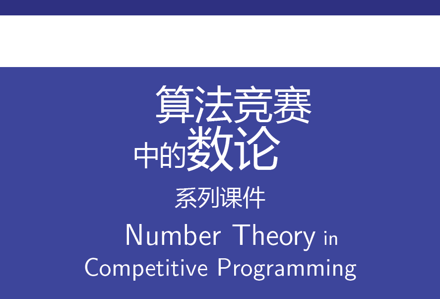

# 算法竞赛中的数论 – 系列课件

正在绝赞编写中！

本系列课件的 PDF 版本遵循 CC BY-SA 4.0 版权协议。 
本系列课件的 LaTeX 源代码以 GNU GPL v3.0 协议开源。 
（注意 GNU GPL v3.0 包含 CC BY-SA 4.0）

力求做到的目标：

- 比任何现存算法竞赛博客更**精炼的表述**（欢迎提 issue）
- 更具**整体逻辑**的知识点编排结构（欢迎提 issue）
- **涵盖大部分** NOI 级别及以下的数论知识点（欢迎提 issue）
- 毫无经验的初学者按照顺序阅读，不借助其他资料也可**完全掌握**（欢迎提 issue）

包含以下内容：

1. 基础知识、简单素数筛法、与解线性 Diophantus 方程
   - 感觉每个课件需要插入一个专门讲例题的课件（关于例题的选取有什么想法吗？）
2. 模 m 剩余系的加法与乘法结构及其应用（制作中）
3. 中国剩余定理（预定）
4. 敬请期待……（欢迎提 issue）

官方英文名：Number Theory in Competitive Programming (Lecture Slide Series)。

## 如何贡献

在阅读课件的过程中，如果发现笔误、逻辑错误、或排版错误等，请通过 QQ 联系我（3507898808）。当然，更推荐发 GitHub issue，但如果没有 GitHub 的账号或使用经验（作为普通 OIer，这很正常），仍然欢迎通过 QQ 联系。

我们不会有读者群之类的东西，但有一个“编写小组” QQ 群，但我希望只让有较大意愿探讨课件编写、或能提供较大帮助的朋友加入，并且要求你必须是一个有在中国的比赛经验的 OIer 或 XCPCer。 
这个群是推荐 + 邀请制的，我不会通过任何渠道给出加群的方式，包括群号、二维码等。 
如果你认为你对知识点编排的整体逻辑能提供想法、或者拥有较多的算法竞赛教学经验愿意分享、或者掌握了一些在算法竞赛中不常见的数论技术、或者对一些数论题有独到的理解，欢迎你通过 QQ 联系我（3507898808），我会将你拉进群。

## 编写指南

内容：

- 翻译时丢弃人名形容词后缀（[带后缀的数学家名字，例如「abelian」，在译为中文而保留英文名字「abel」时，是否应该保留后缀？](https://www.zhihu.com/question/54747550)）。
- 减少单页文字数量。

格式：

- 行间数学公式优先考虑使用 `\[ \]` 或 `\begin{align*} \end{align*}`，记得在前后文添加 `%` 注释防止多余换行。
- 关于上一条中的多余换行问题，注意 `center` 环境前后是否分段应由上下文决定。
- 换行后手动缩进记得添加 `\-`。
- mymulticols 环境相比 multicol 宏包的 multicols 环境，删除了附加垂直间距，并提供对开头与（或）结尾为 list（itemize、enumerate、description）的适配（添加对应的垂直 `\topsep` 间距）（具体见自定义文档类）。

关于动画：

- 在简单页面，尽量多地使用 `\pause` 进行简单动画，而不是复杂的 overlay specification 例如 `only`、`uncover` 等。
- 为了与 `\pause` 相符，应使用 `\uncover` 和 `uncoverenv` 环境，而不是 `\visible` 和 `visibleevn` 环境。这也方便他人进行 `\setbeamercovered{transparent}` 等设置。 
  注意此时要考虑到 `uncover` 并未隐藏内容而只是增加透明度，所以可以出现内层 `only` 的 overlay specification 超出外层的 `uncover` 的情况。并且需要尽量避免 `uncover` 或其他 overlay specification（非 `only`）的嵌套造成透明度不正确，也需要避免 `\pause` 后的 `uncover` 或其他 overlay specification（非 `only`），或 `uncover` 或其他 overlay specification（非 `only`）内部的 `\pause`，而连续的 `\pause` 当然是允许的。
- 在 `\pause` 需要嵌套在 `only` 内部时，使用与 `only` 同步的 `\pause` 而非 `\pause[number]`（否则可能造成页脚消失），见 Part 1 中 Euclid 算法一页（frame 45）。
- PDF 最好要经过 `\setbeamercovered{transparent}` 和 `\setbeamercovered{invisible}` 两重测试。

## 关于课件与讲稿的分离

此处，**课件**（**lecture slides**）指类似使用 PowerPoint、LaTeX beamer、Markdown Slidev 等工具制作的幻灯片（presentation），而**讲稿**（**handouts**）指类似使用 Microsoft Word、LaTeX article、Markdown 等工具进行无复杂格式的竖直排版的文字文件，需要与相关课件配套，并且有着适合讲课者通过联系前后内容和观察篇幅以控制节奏和展开细节、以及适合听课者针对细节复习和梳理前后内容的特征。

有意见指出课件应该控制文字内容的比重，多使用图示并利用课件的动画效果（尽管 beamer 没有“动画”），不要事无巨细地展开细节。关于这一点，我持**保留意见**，本系列课件的目标之一就是**覆盖细节的知识点**，如果不将它们花费篇幅展示出来则无法达成这一目标。

但课件与讲稿的分离仍然是**值得研究**的，可以在讲稿中提供**延伸阅读内容**，提供更多**例题和习题**（以及对应的分析或题解），和展示**不方便在课件中给出**的内容（例如会打断听课者思路的过于细节、与后文不会产生联系的内容（但仍是有价值的知识点或 trick，或能从冷门角度给出理解），这种现象在目前课件中已有一些例子）。

基于此，讲稿可以提供更多详细信息，同时课件中的一些细节内容**可以被删除**，即要么作为讲课者可以参考讲稿**自由选择是否插入**的内容、要么作为**补充阅读资料**。进一步地，课件中的文段也**不需要有连贯的上下文**，而可以只使用**关键词句串起前后逻辑**，完整连贯的上下文应由讲课者参考讲稿通过讲课时的口头表达提供。

应当将讲稿视作系列课件的一部分，即认为若缺少了讲稿提供的内容，系列课件将是不完整的，但仍需确保当听课者只能接触课件时，能够拥有预期的听课体验。

## 自定义文档类与自定义宏包

使用根目录下的 `pkslide.cls` 作为文档类和 `pkntcpslide.sty` 作为宏包以支持**结构化和语义化的编写**，这也是 LaTeX 写作的宗旨之一。

`pkslide` 以 `ctexbeamer` 文档类为基础，拥有以下特性：

- 选定了本人喜欢的主题 Berlin；
- 修改了页眉（headline）格式（显示“小小节”）；
- 修改了页脚（footline）格式（换用 infolines 主题的单行形式）；
- 更换了汉字字体（思源黑体、思源宋体、方正黑仿、霞鹜文楷）；
- 将数学公式字体调整为衬线体；
- 减小了文字页边距以显示更多内容；
- 自动在课件开头插入标题页、关于页、目录页；
- 自动在每节开头插入节标题；
- 自动在小小节处插入“当前进度”页面；
- 定义 `\emptyline` 命令以结构化地满足竖向空行的需求；
- 定义 `\textboldcolor` 命令以满足在水平模式中“变色 + 文字加粗 + 公式加粗”的需求，在数学模式中也可以使用；
- 定义 `\fdf` 命令，调用 `\textboldcolor` 命令，满足强调概念定义（first-define）和中英文对照表的需求。
- 定义 `structuregreen` 环境，满足课件内容重心切换时，切换颜色主题的需求（例如，从知识点切换到例题时）；
- 定义 `\firstauthor`、`\firstinstitute` 命令，以更便捷地设置作者信息、适应 OIer/XCPCer 中常见的使用昵称（网名、用户名、ID、姓名缩写）的需求、支持机构（学校）英文名显示；
- 定义 `\addauthor`、`\addinstitute` 命令，支持以相同格式添加作者和机构；
- 定义 `\originalfinaldate` 命令，以有选择性地显示初版时间和编译时间；
- 等等……（仍在更新）

`pkslide` 文档类目前已经初步完善，添加更多功能后期望能够满足更多的使用 ctexbeamer 的 OI 课件写作的需求。

`pkslide` 应经过广泛询问其他 OIer/XCPCer 课件制作者的建议后进行进一步的完善，并提供详细功能文档。

`pkntcpslide` 中的 `ntcp` 即 **N**umber **T**heory in **C**ompetitive **P**rogramming。目前由于写作经验不够丰富，无法确定哪些内容应分配到宏包而非文档类中，故此宏包目前不存在，自然也未投入使用。一些合理的宏包内容应包含语义化的 OI/XCPC 中的数论专用符号等。
